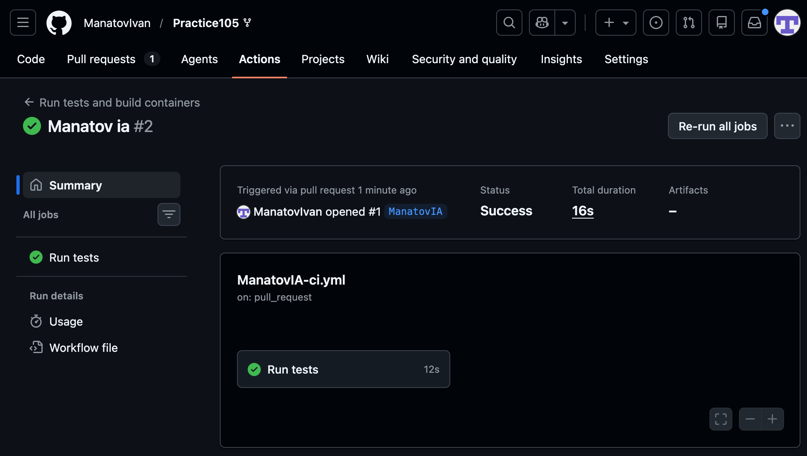

# Генератор паролей

Веб-приложение с микросервисной архитектурой для генерации паролей.

## Архитектура

```
Браузер
   ↓
gateway (Nginx, порт 8080)
   ├── /       → frontend (статический HTML/JS)
   └── /api/*  → backend (Flask WSGI)
                    ↓ HTTP
                 worker (Flask, длинная задача)
```

Сервисы взаимодействуют через внутреннюю сеть Docker. Единственная внешняя точка входа — `gateway`.

## Запуск

```bash
docker compose up --build
```

Приложение доступно по адресу: http://localhost:8080

## Использование

1. Откройте браузер на http://localhost:8080
2. Укажите длину пароля, количество и набор символов
3. Нажмите **Сгенерировать**
4. Дождитесь выполнения фоновой задачи (~4 сек)
5. Скопируйте нужный пароль кнопкой **copy**

## Стек

- Frontend: HTML + CSS + JavaScript (статика, Nginx)
- Backend: Python + Flask + Gunicorn
- Worker: Python + Flask + Gunicorn + ThreadPoolExecutor
- Gateway: Nginx
- Оркестрация: Docker Compose

---

## CI/CD

Репозиторий: https://github.com/ManatovIvan/Practice105

### Описание workflow

Файл: [`.github/workflows/ManatovIA-ci.yml`](../.github/workflows/ManatovIA-ci.yml)

CI запускается автоматически при открытии **pull request в ветку `main`**, а также при push в ветку `ManatovIA`.

#### Шаги pipeline

| № | Шаг | Описание |
|---|-----|----------|
| 1 | Code checkout | Клонирование репозитория (`actions/checkout@v6`) |
| 2 | Python installation | Установка Python 3.12 (`actions/setup-python@v6`) |
| 3 | Install backend dependencies | `pip install -r ManatovIA/backend/requirements.txt` |
| 4 | Run backend tests | `pytest ManatovIA/backend` — 4 теста |
| 5 | Install worker dependencies | `pip install -r ManatovIA/worker/requirements.txt` |
| 6 | Run worker tests | `pytest ManatovIA/worker` — 7 тестов |

#### Тесты

**backend** (`backend/test_backend.py`) — unit-тесты с моками HTTP-вызовов к worker:
- `test_generate_returns_task_id` — POST `/api/generate` возвращает `task_id` и статус `queued`
- `test_generate_forwards_params_to_worker` — параметры корректно передаются в worker
- `test_status_returns_worker_response` — GET `/api/status/<id>` проксирует ответ worker
- `test_status_propagates_404` — 404 от worker передаётся клиенту

**worker** (`worker/test_worker.py`) — unit-тесты без внешних зависимостей:
- `test_strength_*` (3 теста) — оценка силы пароля: weak / medium / strong
- `test_create_task_*` (2 теста) — POST `/tasks` создаёт задачу
- `test_get_task_*` (2 теста) — GET `/tasks/<id>` возвращает задачу или 404

### Скриншоты

#### Успешное выполнение



